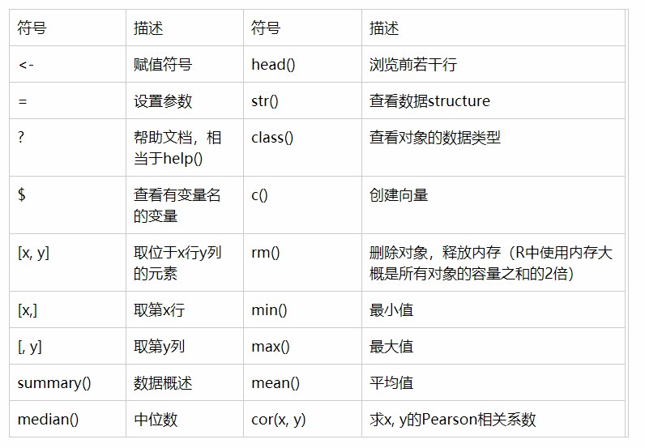
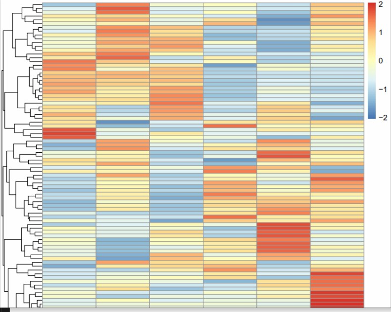

## 前言
因为工作需求，接下来一段时段需要大量的R绘图操作，而我并没有学习过R，因此特地补充一下基础。其实R和python非常像。python中有交互式和脚本式两种运行方式，R也同样有这两种运行方式，而且安装工具包的方式也相近，因此有python基础可以有利于我们快速学习R。当然，两者也存在很多的区别，比如数据类型和数据结构不太一样，当然还有其他区别，不一一列举。R到底能做到些什么，而又该怎么做呢？这是我们接下来要探索的问题。

<!--more-->

## 1.R简介
R是一门用于做统计分析和绘图的解释性语言，产生于上世纪八十年代的贝尔实验室。R应用领域也很多，在生信领域主要用于绘制科学图片，当然也可以进行统计计算，归根到底，工具发挥什么作用还是取决于使用工具的人对吧。

R是一个开源自由的软件，同时对应的工具库也很多，所以目前来看也依然有非常多的用户，这也是一个良好社区的基础，而良好社区几乎是一门语言能否健康发展的全部因素。

R的工具包管理软件是CRAN，其中这个管理工具上的软件包都是经过了严格审核的，因此我们可以通过Rstutio或者命令行中使用help()命令查看详尽的帮助文档，通过这些文档我们可以很好地了解和学习工具包的使用。就这一点而言，R比python更加出色。

## 2.R基础使用
* install.packages('pheatmap')    #安装工具库
* library(pheatmap)    #导入工具库
* help('pheatmap')     #读取工具库帮助文档
* example('pheatmap')  #读取对应工具包的例子
* variable <- "value"   #创建变量
* 控制数据流
* 输出数据结果

## 3.R的数据类型和数据结构
* 数据类型
  * 字符型  'a' 'hello world'
  * 数值型  1 2  1:4
  * 逻辑型（布尔型）FALSE TRUE
* 数据结构
  * vector   向量，一维数组，K = 1 
  * factor    因子
  * array      数组，K维度数组，K > 2
  * matrix    矩阵，K = 2
  * list         可以包含任何类型的对象，像是一个集合，对象不等长
  * dataframe   数据框，类似于一个二维数据表格，每一列等长，和列表有点像

## 4.访问数据
* 内置数据集
* cars     一个2列数据的list
* head(cars)
* str(cars)
* class(cars)
* letters  含有小写字母的vector
* LETTERS 含有大写字母的vector
* month.abb   月份缩写的vector
* month.name  月份全称的vector
* ToothGrowth  内置data.frame的数据表
* 读取数据文件

data <- read.table(file, header=T, sep ="\t", row.names = 1)
data <- read.csv(file, header = TRUE, sep = ",", quote = "\"", dec = ".", fill = TRUE, comment.char = "", ...) 
data <- read.csv2(file, header = TRUE, sep = ";", quote = "\"", dec = ",", fill = TRUE, comment.char = "", ...)
data <- read.delim(file, header = TRUE, sep = "\t", quote = "\"", dec = ".", fill = TRUE, comment.char = "", ...)
data <- read.delim2(file, header = TRUE, sep = "\t", quote = "\"", dec = ",", fill = TRUE, comment.char = "", ...)

## 5.常用符号 函数

## 
6.绘图基础
  1. R内置绘图方法plot()
  2. 工具包绘图：ggplot2/pheatmap/ggpubr等
  3. eg. 使用工具包pheatmap(data_new, scale = 'row', cluster_cols = F, show_rownames = F)可以绘制热图，结果如下：

## 7.绘图进阶
ggplot2绘图层次
  1. ggplot()   初始化
  2. gemo_bar()  图形类型
  3. cale_x_...()   调整对象
  4. theme_...() 内置主题  + theme(<config>)  添加自定义主题设定

备注：这四个层次是由高到低的设置，就像是在画图的时候由大到小的一个聚焦过程，在绘图的时候可以由此来确定自己绘图的层次和功能。这和python中的matplotlib的4个绘图层次非常相似，因此可以互相促进理解。

**Tips:**
  1. getwd()   获取当前工作目录，可以在命令行也可以在脚本中书写
  2. setwd(choose.dir())   设定工作目录，可以更改自己的工作目录
  3. 进入R的交互式运行shell的方式，可以在命令行里输入R.exe即可进入（Linux中输入R）
  4. 脚本式运行的方式 命令行下运行 Rscript helloworld.R
  5. 运行命令快捷键   ctrl+Enter
  6. dev.off()  清理工作空间缓存
  7. 数据按列填充，也就是一列一列填写数据
  8. R中变量命名可以包含 . 这个符号
  9. 帮助文档结构（好的帮助文档是一个艺术品，而文档的编写就是创造艺术品，需要练习）
     1.  description   描述功能
     2.  usage   使用方法
     3.  arguments   参数解释
     4.  details    细节补充
     5.  author    作者信息
     6.  examples   使用示例

## 结语
R还是使用挺方便的，特别是在画图的过程中，感觉操作更加好理解，而且一个工具包就非常强大，可以不用再怎么装依赖库，这是非常棒的一点。现在算是R的基本入门只是，之后想要有进一步的深入就需要自己去挖掘了。

