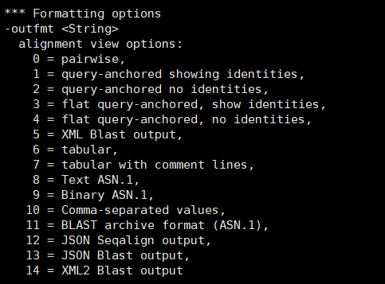
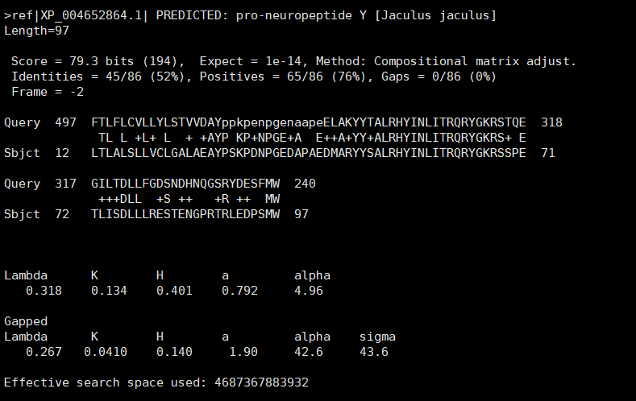

>继上一篇edgeR基因差异分析，通过采用R中的edgeR/limma这两个包，完成了差异基因的分析。在这个分析中总共分为了9组进行差异分析，最终结果取了并集，然后对并集进行blast，进而统一进行blast2go注释，再对每一组差异分析单独的从结果中匹配出相应的注释。现在，我需要做的就是这个并集的blast，为blast2go做准备。值得注意的是，这里的blast效率可能并不高，因此会耗费大量时间，可以考虑拆分文件，开启多个进程同时比对。

## 1. blast简介

blast全称是Basic Local Alignment Search Tool，是NCBI运营的一个基础序列比对软件，通过这个软件可以做到很好的多序列比对，比对到蛋白质或者核酸数据库中。众所周知，序列比对是生信分析的基础，不管是哪一个组学的内容，都必须进行比对才能开启下一步的工作。blast不是单纯的一个program，而是多个program的综合称呼：
|program|progress|
|:----|:----|
|blastn|nr-->nr|
|blastx|nr-->pro|
|tblastn|pro-->nr|
|blastp|pro-->pro|

<!--more-->
现在在这个项目中，我们需要做的下一步是比对到nr数据库，nr数据库是一个蛋白质序列库，我们的序列是核酸序列，因此我们使用的是blastx program，即核酸比对到蛋白质。还有另外一个数据库——nt，这个数据库是一个核酸数据库，如果需要比对到核酸的话，就可以选择这个数据库进行比对。

## 2. blast使用
如果是第一次使用blast，那么需要做一些前期的准备工作，不过这个准备工作是通用的，完成一次后，下一次可以直接使用，现在我们从准备工作开始做起。
### 2.1 下载安装blast
可以进入官网寻找到下载地址`ftp://ftp.ncbi.nlm.nih.gov/blast/executables/blast+/LATEST/`，点击网址进入选择合适的版本，download到自己的服务器或者本地中。
1. 解压blast文件，将bin目录下内容copy到/usr/local/bin中
>这一步的目的是为了让blast能够直接在服务器任何一个地方使用，而不用输入绝对路径，相当于是添加到了环境变量中，因为/usr/local/bin就是环境变量中的一个，所以同样也可以通过添加新环境变量的方式来达到以上目的。
2. 制作软链接，将解压后的的bin目录软链接到/home/username
3. 编辑.bashrc文件，添加`export PATH=/home/username/bin/:$PATH;`，即添加环境变量
### 2.2 准备数据库
在这里除了blast程序之外，还得有本地的数据库才行。so，第一步，先下载blast对应的一些数据库。
1. 下载数据库（nr nt等）：ftp://ftp.ncbi.nlm.nih.gov/blast/
>也可以先浏览一下这个网站：https://www.ncbi.nlm.nih.gov/books/NBK62345/
2. 通过2.1中下载的blast软件构建索引|makeblastdb
>makeblastdb -in mature.fa -input_type fasta -dbtype nucl -title miRBase -parse_seqids -out miRBase -logfile File_Name

|options|explain|
|:----|:----|
|-in|你要格式化的fasta序列|
|-dbtype|database的类型，nucl为核酸，prot为蛋白|
|-title|给数据库起名字，不能作为-db的参数使用|
|-parse_seqids|暂时未知|
|-out|给数据库起个名字，能在blast+时作为-db的参数使用|
|-logfile|日志文件，默认输出到屏幕|

### 2.3 开始使用blast
最好保持一个良好习惯，先新建好文件目录，整理好文件，做好记录，然后再进行blast比对。
> nohup blastx -query ../up1.fasta -db /B313/public_db/blast/nr -outfmt 5  -num_threads 20 -out up1-blastx >log1.out 2>&1 &

> nohup blastx -query ../up4.fasta -db /B313/public_db/blast/fish_prot -outfmt 5  -num_threads 8 -out up4-blastx >log4.out 2>&1 &

>nohup blastx -query ../down1.fasta -db /B313/public_db/blast/fish_prot -outfmt 5  -num_threads 8 -out down1-blastx >dlog1.out 2>&1 &

>nohup blastx -query ../gene_data/53vsX-downgenes.fasta -db /B313/public_db/blast/fish_prot -outfmt 5  -num_threads 8 -out 53vsXdown-blastx >dlog_53.out 2>&1 &

>nohup blastx -query ../gene_data/53vsX-upgenes.fasta -db /B313/public_db/blast/fish_prot -outfmt 5  -num_threads 8 -out 53vsXup-blastx >ulog_53.out 2>&1 &

>nohup blastx -query ../gene_data/54vsY-downgenes.fasta -db /B313/public_db/blast/fish_prot -outfmt 5  -num_threads 8 -out 54vsYdown-blastx >dlog_54.out 2>&1 &

>nohup blastx -query ../gene_data/54vsY-upgenes.fasta -db /B313/public_db/blast/fish_prot -outfmt 5  -num_threads 8 -out 54vsYup-blastx >ulog_54.out 2>&1 &

参数解释：
|options|explain|
|:----|:----|
|-query|序列，需要比对的序列文件，fasta格式|
|-db|database，在上一步中构建时取得名字，常用为nr、nt两个数据库|
|-outfmt|选择比对输出的类型，有0-14可以选，5是xml文件输出，方便blast2go的进行|
|-out|输出文件|
|-num_threads|线程数量，即使用逻辑CPU的数量，可以加快速度|
注：还有其他的一些参数，可以进一步查询blast官网文档

### 2.4 blast结果
我还没有跑完出来，不太清楚，但是可以先留个位置，等结果出来后进行展示。

## 总结
1. blast基本使用，生信基本工作
2. 构建数据库，这一个要掌握好，以后很有可能要自己搭建数据库，满足个性化需求
3. 结果文件的输出，选择xml，方便接下来进行注释

