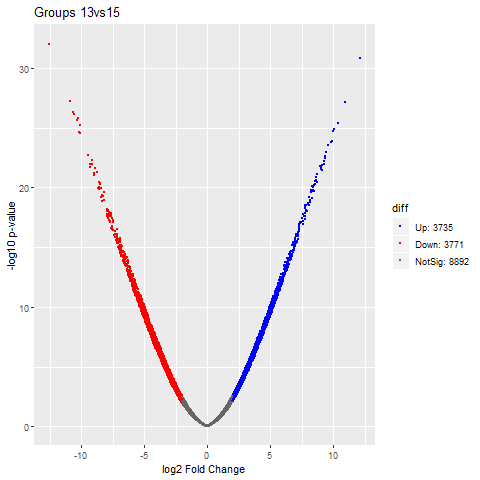

>这部分内容还是第一次转录组的实操练习，之前已经完成了序列的拼接、去冗余，并且已经做了层次聚类，统计了每个transcript的raw counts，现在进入了差异基因分析的步骤。因为不管采用什么软件，本质的方法是一致的，因此也具有一定的通用性，或者可以迁移到其他基因分析的项目中，因此要用心学习。

## 前言
这里采用的是R中的edgeR包来进行分析，因此需要先做环境准备，现在开始。

## 1. 环境准备
* 安装R，可以到官网download
* 安装相应包，如下
>if (!requireNamespace("BiocManager", quietly = TRUE))
    install.packages("BiocManager")
>if (!requireNamespace("edgeR", quietly = TRUE))
    BiocManager::install("edgeR")
>if (!requireNamespace("airway", quietly = TRUE))
    BiocManager::install("airway")

<!--more-->
## 2. 全过程代码
```
# 导入依赖包
library(limma)
library(edgeR)
library(ggplot2)

# 设置工作区
setwd('E://Desktop//Transcript')

#读取数据，设置分组
targets <- data.frame(read.csv('all_counts.csv',header=1,row.names=1))
group <- 1:2
counts <- targets[,1:2]

#构建DGEList对象
dgelist <- DGEList(counts = counts, group = group)
dgelist

#CPM 标准化，过滤低表达counts
keep <- rowSums(cpm(dgelist) > 1 ) >= 2  #这里的设置很重要，会很大程度影响结果
dgelist <- dgelist[keep, ,keep.lib.sizes = FALSE]

#TMM 标准化
dgelist_norm <- calcNormFactors(dgelist, method = 'TMM')
dgelist_norm

#估算离散值
design <- model.matrix(~group) #构建分组矩阵
#dge <- estimateDisp(dgelist_norm, design, robust = TRUE) #估算离散值
dgelist_norm$common.dispersion <- 0.1

#差异基因分析
#negative binomial generalized log-linear model #拟合
fit <- glmFit(dgelist_norm, design, robust = TRUE)     #拟合模型
lrt <- glmLRT(fit)   #统计检验

#查看默认方法获得的差异基因
dge_de <- decideTestsDGE(lrt, adjust.method = 'fdr', p.value = 0.01)  
summary(dge_de)

# 添加标签，区别up down no三种基因
diff_stat <- lrt$table
diff_stat[which(diff_stat$PValue < 0.01 & diff_stat$logFC >= 2),'diff'] <- 'up'
diff_stat[which(diff_stat$PValue < 0.01 & diff_stat$logFC <= -2),'diff'] <- 'down'
diff_stat[!(diff_stat$diff %in% c('up', 'down')),'diff'] <- 'no'

# 查看并保存添加标签后的数据
head(diff_stat,n=10)
write.csv(diff_stat,file = "edgeR.csv")

# 做火山图
ggplot(diff_stat, aes(x=logFC, y=-log10(diff_stat$PValue))) +
geom_point(aes(color = diff), size = 0.5) +
scale_colour_manual(limits = c('up', 'down', 'no'), values = c('blue', 'red', 'gray40'), labels = c('Up OTUs', 'Down OTUs', 'No diff OTUs')) +
labs(title="Groups 13vs15",x = 'log2 Fold Change', y = '-log10 p-value')
```

成果示例：




## 总结
1. 在这个包的分析过程中，可以调整dispersion/pvalue/logFC这3个参数以及CPM 标准化的过滤阈值来调控我们最终获取的差异基因的数量，一般我们能分别获得几千个上下调基因就可以了，可以适当调整参数，方便下一步分析。
2. 在提取出来后，我们只是得到对应的id和它的down或者up标签，还需要把他们从原来的fasta文件中提取出来，这样才能接着做blast分析，这里使用的工具是TBtools这个软件，可以很好的做到这一点，但是建议还是得自己编程摸索一下，避免对别人的软件过渡依赖。
3. 在Linux中还有专门的split命令，可以直接一句命令进行文件拆分，拆分的依据可以是行数，也可以是大小（如10M），还可以是其他标准，这个非常方便，能够快速的进行拆分，然后我们只需要对拆分的文件进行重命名就好了。
4. 在使用TBtools的时候，要注意的是，原始的fasta文件不要把其中的id前面的“>”去掉了，去掉后，这个软件没有办法定位哪里是序列开头，这样子就会导致提取序列出错。