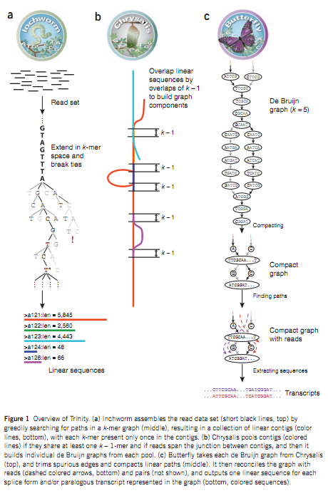
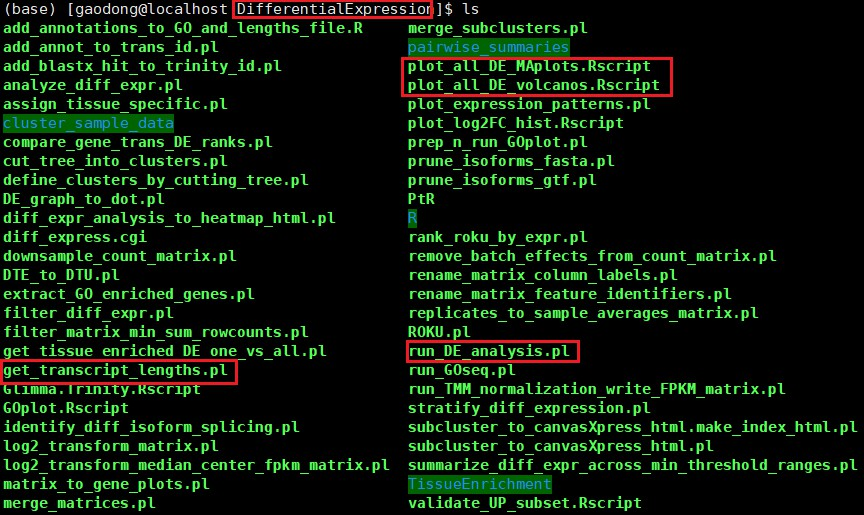

>这是一篇关于使用Trinity进行无参转录组分析的文章，首先会简单介绍转录组学，接着会介绍Trinity软件的使用，最后会记录相关的下游分析

## 一、转录组学
### 概述：
1. 转录组广义上指在某一生理条件下，细胞内所有转录组产物的集合，包括：mRNA、ncRNA、rRNA等；狭义上指所有mRNA的集合。<br>
2. 转录组测序的研究对象为特定细胞在某一功能状态下所能转录出来的所有RNA的总和，主要包括mRNA和ncRNA。<br>
3. 转录组具有时间特异性、组织特异性、空间特异性等特点。

|类型|特点|分析策略|
|:----|:----|:----|
|有参转录组|需要所研究的物种有组装注释质量较好基因组序列，<br>一般来说比对效率达到70%以上才能满足后续分析。|比对—定量—差异分析—功能富集分析（下游分析）|
|无参转录组|缺乏相应的质量较高的基因信息，需要从零开始组装分析|组装—定量—差异分析—功能富集分析（下游分析）|
>下游分析包括：GO基因功能注释、KEGG通路分析、mRNA表达量计算、差异基因筛选、功能和通路富集分析、时间序列分析、共表达网络分析等
<!--more-->
## 二、Trinity介绍与使用
### 基本介绍
>是由Broad Institute 开发的转录组de novo组装软件，由三个独立的软件模块组成：*Inchworm （虫）（C++）* 、*Chrysalis （蛹）（C++）*、*Butterfly （蝶）（Java）*。三个软件依次来处理大规模的RNA-seq的reads数据。

|组成部分|作用|工作过程|
|:----|:----|:----|
|Inchworm （虫）（C++）|序列延伸|a. 将 reads切为 k-mers (k bp长度的短片段)<br>b. 利用Overlap关系对k-mers进行延伸 (贪婪算法)<br>c. 输出所有的序列 (“contigs”)|
|Chrysalis （蛹）（C++）|构建de Brujin graph|a. 聚类所有相似区域大于k-1bp的 contigs<br>b. 构图 (区分不同的 “components”)<br>c. 将reads比对回 components，进行验证|
|Butterfly （蝶）（Java）|解图，列举转录本|a. 拆分graph 为线性序列<br>b. 使用reads以及 pairs关系消除错误序列|


### Trinity使用
#### 1. 下载与安装<br>
trinity最新版本是v2.4.0 下载官网在：https://github.com/trinityrnaseq/trinityrnaseq/wiki
```
nohup wget -c https://github.com/trinityrnaseq/trinityrnaseq/archive/Trinity-v2.4.0.tar.gz 1>trinity.o 2>trinity.e &   # 下载

tar -zxvf Trinity-v2.4.0.tar.gz   # 解压

make    # 编译
```
#### 2. 使用<br>
##### 命令：
`Trinity --seqType fq --left reads_1.fq --right reads_2.fq --CPU 6 --max_memory 20G `<br>
##### 几个重要参数介绍：<br>
>`--seqType` 支持输入数据格式为 fq 或者 fa<br>
**双端测序：**`--left`为read1 `--right`为read2 多个样品的reads由逗号隔开，不允许出现空格（依版本而定）<br>
**单端测序：**`--single` 加上文件 多个样品的reads由逗号隔开，不允许出现空格（依版本而定）<br>
`--CPU` 软件所用CPU数量<br>
`--max_memory` 内存控制（组装过程中，jellyfish这一步是最耗费资源的一步 所以这个内存主要由jellyfish控制）<br>
`--SS_lib_type RF`   链特异性文库需要加上这个参数，其中RF表示文库的构建方法，[点这了解，最好看看](http://www.genek.tv/article/27)<br>
`--no_run_butterfly` 不进行butterfly步骤，在Chrysalis这一步完成后中断<br>
`--no_run_quantifygraph` 不进行quantifygraph这一步<br>
`--output` trinity的输出文件夹，默认在*trinity_out_dir/Trinity.fasta*<br>
`--no_version_check` 不汇报版本信息<br>

## 可选参数
## Misc：
`--SS_lib_type `       reads的方向。成对的reads: RF or FR; 不成对的reads: F or R。在数据具有链特异性的时候，设置此参数，则正义和反义转录子能得到区分。默认情况下，不设置此参数，reads被当作非链特异性处理。FR: 匹配时，read1在5'端上游, 和前导链一致, read2在3'下游, 和前导链反向互补. 或者read2在上游, read1在下游反向互补; RF: read1在5'端上游, 和前导链反向互补, read2在3'端下游, 和前导链一致;
<br>`--output`             输出结果文件夹。默认情况下生成trinity_out_dir文件夹并将输出结果保存到此文件夹中。
<br>`--min_contig_length`  报告出的最短的contig长度。默认为200
<br>`--jaccard_clip`       如果两个转录子之间有UTR区重叠，则这两个转录子很有可能在de novo组装的时候被拼接成一条序列，称为融合转录子(Fusion Transcript)。如果有fastq格式的paired reads，并尽可能减少此类组装错误，则选用此参数。值得说明的是：1. 适合于基因在基因组比较稠密，转录子经常在UTR区域重叠的物种，比如真菌基因组。而对于脊椎动物和植物，则不推荐使用此参数; 2. 要求fastq格式的paired reads文件(文件中reads名分别以/1和/2结尾，以利于软件识别)，同时还需要安装bowtie软件用于reads的比对; 3. 单独使用具有链特异性的RNA-seq数据的时候，能极大地减少UTR重叠区很小的融合转录子; 4. 此选项耗费运算，若没必要，则不用此参数。
<br>`--prep`               仅仅准备一些文件(利于I/O）并在kmer计算前停止程序运行
<br>`--no_cleanup`         保留所有的中间输入文件
<br>`--full_cleanup`  仅保留Trinity fasta文件，并重命名成${output_dir}.Trinity.fasta
<br>`--cite`               显示Trinity文献引证和一些参与的软件工具
<br>`--version`            报告Trinity版本并推出

## Inchworm 和 K-mer 计算相关选项：
`--min_kmer_cov`     使用Inchworm来计算K-mer数量时候，设置的Kmer的最小值。默认为1<br>
`--inchworm_cpu `     Inchworm使用的CPU线程数，默认为6和--CPU设置的值中的小值。

## Chrysalis相关选项：
`--max_reads_per_graph`   在一个Bruijn图中锚定的最大的reads数目，默认为200000
`--no_run_chrysalis`      运行Inchworm完毕，在运行chrysalis之前停止运行Trinity
`--no_run_quantifygraph`  在平行化运算quantifygrahp前停止运行Trinity

## Butterfly相关选项：
`--bfly_opts`                    Butterfly额外的参数<br>
`--max_number_of_paths_per_node` 从node A -> B,最多允许多少条路径。默认为10<br>
`--group_pairs_distance `        最大插入片读长度，默认为500<br>
`--path_reinforcement_distance`  延长转录子路径时候，reads间最小的重叠碱基数。默认PE:75; SE：25<br>
`--no_triplet_lock `             不锁定triplet-supported nodes<br>
`--bflyHeapSpaceMax`             运行Butterfly时java最大的堆积空间，默认为20G<br>
`--bflyHeapSpaceInit  `          java初始的堆积空间，默认为1G<br>
`--bflyGCThreads  `              java进行无用信息的整理时使用的线程数，默认由java来决定<br>
`--bflyCPU `                     运行Butterfly时使用的CPU线程数，默认为2<br>
`--bflyCalculateCPU   `          计算Butterfly所运行的CPU线程数，由公式80% * max_memory / maxbflyHeapSpaceMax 得到<br>
`--no_run_butterfly`             在Chrysalis运行完毕后，停止运行Butterfly<br>

##### 结果
>最终会得到一个Trinity.fasta的文件，在同文件夹下还会有其他的中间过程产生的文件，其中这个文件最为重要，是最终的组装结果

#### Trinity中自带脚本
1. for DifferentialExpression

2. utils


## 三、下游分析（有待完善）
### 1. GO功能注释
### 2. KEGG通路分析
### 3. 差异基因分析与筛选
### 4. 功能和通路富集分析
### 5. 结果可视化（火山图、箱线图、MAplot、pheatmap等）

**参考资料**
1. https://github.com/trinityrnaseq/trinityrnaseq/wiki # 官方文档<br>
2. https://www.meiwen.com.cn/subject/bnsokctx.html # 介绍博客<br>
3. http://www.360doc.com/content/16/0910/15/35684706_589802384.shtml # 无参转录组分析 <br>
4. https://www.omicsclass.com/article/295 # 转录组学知识点<br>
5. https://www.meiwen.com.cn/subject/tsutnqtx.html # 可视化分析（重点火山图）<br>
6. https://blog.csdn.net/niuhuihui_fei/article/details/72723781 # 介绍博客（Trinity参数）