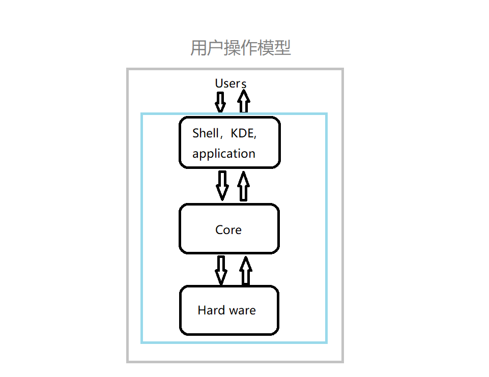

## 概述
第一次听说的bash时是一脸懵逼的，不明白此为何物，最近看了一下相关书籍，捋了捋关于shell/bash/linux/GNU之间的关系，也加深了对于操作系统的理解，顺便还了解了一下shell编程的一些知识，接下来我们按顺序聊聊。
## GNU与Linux
在谈论Linux的时候，就不得不提到GUN，虽然现在大家一般把某些操作系统称之为Linux，但是实际上，更准确的称呼应该是GUN/Linux操作系统。这是为什么呢？这就得从上世纪90年代说起了。
<!--more-->
在上世纪90年代，随着计算机技术的发展，计算机软件也日新月异，但是随之而来的是计算机软件的商业化浪潮，Microsoft就是这个浪潮上的领军企业，在这个浪潮中Microsoft的windows系统逐渐奠定了世界PC操作系统之王的地位。在这个时候，有这么一批人，他们不愿意看到商业化软件限制了大家灵活使用计算机的自由，因此，他们提出来一个计划，这就是自由软件计划，其中GNU就是一个集大成者。

GNU工程的初心就是打造一个完全由自由软件组成的操作系统，GNU的名字全称是——GNU's Not Unix。在GNU工程的计划里，这个操作系统包括了文件管理系统、内存管理系统、邮箱、游戏等方面，经过几年的工作，GNU工程完成了几乎所有除内核以外的其他软件的收集或编写，一个GNU系统即将诞生，但是在写操作内核的时候，GNU团队遇到了一定的困难，这个内核非常难写，但是与此同时，Linus写出来一个操作内核Linux，这个核心很符合GNU工程的需求，因此GNU工程的工程师们决定把Linux适配到GNU中。这个过程并不容易，但是经过大家的努力，最终还是完成了这个任务，GNU系统正式发布，由于Linux已经广为人知，因此在这个系统出来后，大家还是习惯性的称之为Linux操作系统，这也是个历史原因，导致现在大家也都称之为Linux操作系统，但是实际上，Linux只是GNU系统的内核，我们不会因为一个内核就把整个操作系统称之为LINUX，就像联想电脑不会因为用了Intel的CPU就叫做Intel电脑。不过对于普通大众来说，这已经不重要了，大家只是习惯性的称之为Linux系统，但是对于每一个学习计算机的人来说，把这个系统称为GNU/LINUX是对当初所有工程师的尊重，是对他们的致敬。现在的所有的Linux发行版，实际上是GNU/LINUX发行版，例如Ubuntu、CentOS、Debian等一系类发行版。所有这些发行版就像是不同的手机主题，本质上的核心及框架都是一样的，只是为了某些领域做了适应性的配置。

## Linux与shell
在一个操作系统中，操作内核是完成工作的基础，所有工作都必须经过核心来完成，所以我们要使用计算机完成特定的任务时，我们必须通过操作内核来完成。但是，内核是复杂而脆弱的，稍有不慎，就可能会导致系统崩溃，为了避免这个问题的出现，工程师们设计了一个和内核交互的窗口，通过这个窗口可以和内核通信，把我们的指令传递给内核，这个窗口就称之为shell。因为在整个操作系统中，这个窗口是在计算机核心外部的，就像是计算机的最外层，所以也就生动形象的称为Shell——外壳。

## shell与bash
在Linux中，默认的一个通信窗口即shell是bash，但是其实，在Linux中有着很多的可以使用的shell，这也是在上世纪90年代到21世纪之初的时候，在计算机中爆发出来的大量的shell，当时可能盛行很多，其中比如有ksh、sh等。其实bash是sh的增强版，功能非常强大，所以要想真正的灵活使用操作系统，了解一个shell很重要。

那么在Linux中，学习bash就是顺理成章的。接下来就是就是bash的基础学习。见下一篇！

