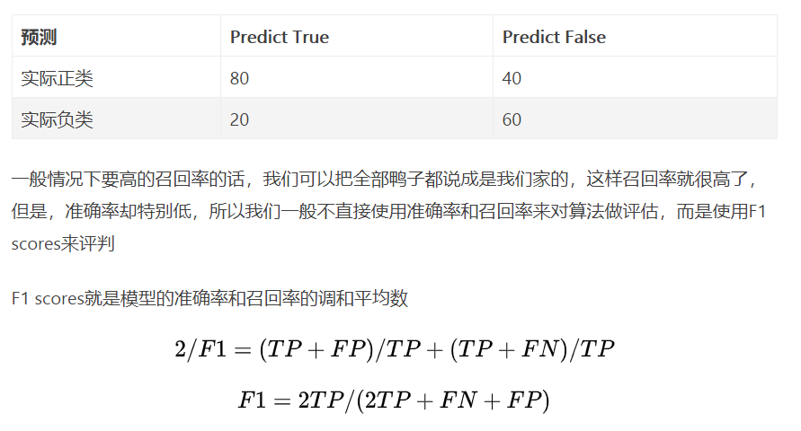

## 1. 前言
文本型数据的读取与训练与图片等其他格式较为一致的数据不同，文本数据一般不定长，所以如果要进行机器学习的矩阵训练，需要先对文本数据进行归一化处理，把文本转换成可以进行运算的shape相同的向量，然后输入算法进行学习。转换的方法有几种，下面的文本表示方法引用自[Datawhale零基础入门NLP赛事 - Task3 基于机器学习的文本分类](https://tianchi.aliyun.com/notebook-ai/detail?spm=5176.12586969.1002.12.6406111aIKCSLV&postId=118254)。

<!--more-->

## 2. 文本表示方法 Part1

在机器学习算法的训练过程中，假设给定$N$个样本，每个样本有$M$个特征，这样组成了$N×M$的样本矩阵，然后完成算法的训练和预测。同样的在计算机视觉中可以将图片的像素看作特征，每张图片看作hight×width×3的特征图，一个三维的矩阵来进入计算机进行计算。

但是在自然语言领域，上述方法却不可行：文本是不定长度的。文本表示成计算机能够运算的数字或向量的方法一般称为词嵌入（Word Embedding）方法。**词嵌入将不定长的文本转换到定长的空间内，是文本分类的第一步。**

#### **One-hot**

这里的One-hot与数据挖掘任务中的操作是一致的，即将每一个单词使用一个离散的向量表示。具体将每个字/词编码一个索引，然后根据索引进行赋值。

One-hot表示方法的例子如下：

```python
句子1：我 爱 北 京 天 安 门
句子2：我 喜 欢 上 海
```

首先对所有句子的字进行索引，即将每个字确定一个编号：

```python
{
	'我': 1, '爱': 2, '北': 3, '京': 4, '天': 5,
  '安': 6, '门': 7, '喜': 8, '欢': 9, '上': 10, '海': 11
}
```

在这里共包括11个字，因此每个字可以转换为一个11维度稀疏向量：

```
我：[1, 0, 0, 0, 0, 0, 0, 0, 0, 0, 0]
爱：[0, 1, 0, 0, 0, 0, 0, 0, 0, 0, 0]
...
海：[0, 0, 0, 0, 0, 0, 0, 0, 0, 0, 1]
```

#### **Bag of Words**

Bag of Words（词袋表示），也称为Count Vectors，每个文档的字/词可以使用其出现次数来进行表示。

```python
句子1：我 爱 北 京 天 安 门
句子2：我 喜 欢 上 海
```

直接统计每个字出现的次数，并进行赋值：

```python
句子1：我 爱 北 京 天 安 门
转换为 [1, 1, 1, 1, 1, 1, 1, 0, 0, 0, 0]

句子2：我 喜 欢 上 海
转换为 [1, 0, 0, 0, 0, 0, 0, 1, 1, 1, 1]
```

在sklearn中可以直接`CountVectorizer`来实现这一步骤：

```
from sklearn.feature_extraction.text import CountVectorizer
corpus = [
    'This is the first document.',
    'This document is the second document.',
    'And this is the third one.',
    'Is this the first document?',
]
vectorizer = CountVectorizer()
vectorizer.fit_transform(corpus).toarray()
```

#### **N-gram**

N-gram与Count Vectors类似，不过加入了相邻单词组合成为新的单词，并进行计数。

如果N取值为2，则句子1和句子2就变为：

```
句子1：我爱 爱北 北京 京天 天安 安门
句子2：我喜 喜欢 欢上 上海
```

#### **TF-IDF**

TF-IDF 分数由两部分组成：第一部分是**词语频率**（Term Frequency），第二部分是**逆文档频率**（Inverse Document Frequency）。其中计算语料库中文档总数除以含有该词语的文档数量，然后再取对数就是逆文档频率。

```
TF(t)= 该词语在当前文档出现的次数 / 当前文档中词语的总数
IDF(t)= log_e（文档总数 / 出现该词语的文档总数）
```

## 3. 算法实现
>The first
```
# Count Vectors + RidgeClassifier

import pandas as pd

from sklearn.feature_extraction.text import CountVectorizer
from sklearn.linear_model import RidgeClassifier
from sklearn.metrics import f1_score

train_df = pd.read_csv('./train_set.csv', sep='\t', nrows=15000)

vectorizer = CountVectorizer(max_features=3000)
train_test = vectorizer.fit_transform(train_df['text'])

clf = RidgeClassifier()
clf.fit(train_test[:10000], train_df['label'].values[:10000])

val_pred = clf.predict(train_test[10000:])
print(f1_score(train_df['label'].values[10000:], val_pred, average='macro'))

#结果输出
# 0.65441877581244
```
>The second
```
# TF-IDF +  RidgeClassifier

import pandas as pd

from sklearn.feature_extraction.text import TfidfVectorizer
from sklearn.linear_model import RidgeClassifier
from sklearn.metrics import f1_score

train_df = pd.read_csv('./train_set.csv', sep='\t', nrows=15000)

tfidf = TfidfVectorizer(ngram_range=(1,3), max_features=3000)
train_test = tfidf.fit_transform(train_df['text'])

clf = RidgeClassifier()
clf.fit(train_test[:10000], train_df['label'].values[:10000])

val_pred = clf.predict(train_test[10000:])
print(f1_score(train_df['label'].values[10000:], val_pred, average='macro'))

#结果输出
# 0.8719098297954606
```

## 4. 补充
>f1_score是什么？f1_score就是模型的准确率和召回率的调和平均数。精确率和召回率是对于分类任务来说的。精确率就是预测正确的结果中，有多少是真正正确的，也就是预测正确的样本中，有多少是正确的对上你认为正确的样本数；召回率(将正类样本预测成正类样本的个数对上全部真正正确的样本的比例)。

* 举个栗子

比如我们有一群外出的鸭子，晚上没有回家，全部都跑到别人家里和别人家的鸭子混在了一起，现在我们要从一大群鸭子里面找出我们家的鸭子，这群鸭子中，有我们的也有别人的，总共鸭子有200只，我们从里面找出来一群鸭子假设为(100只)，以为全部都是我们家的，剩下的100只是别人家的，然后仔细看了一下，里面只有80只，是我们家的，其他都是别人家的，这样我们的准确率就只有80/100也就是0.8，这个时候我爸来说我们家总共有120个鸭，这样我们的召回率就只有80/120也就是0.67左右了，我们列个表格看一下
