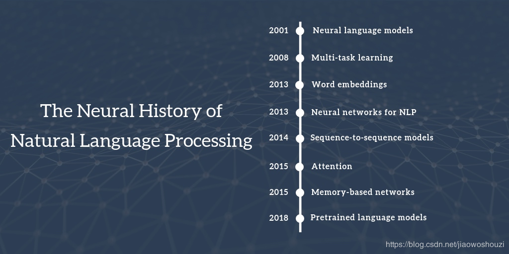

## 前言
在昨天我们实践了word2vec模型，今天还是来学习一个深度学习文本分类模型——bert，这是一个在文本分类中非常著名的模型。接下来让我们来学习一下这个模型。

<!--more-->
## 什么是BERT
>2018年的10月11日，Google发布的论文《Pre-training of Deep Bidirectional Transformers for Language Understanding》，成功在 11 项 NLP 任务中取得 state of the art 的结果，赢得自然语言处理学界的一片赞誉之声。自此，BERT诞生。

BERT全称是Bidirectional Encoder Representation from Transformers，即对Transformer的双向编码进行调整后的算法。这种预训练模型所针对的核心问题，就是NLP的效率难题。

众所周知，智能语音交互要理解上下文、实现通顺的交流、准确识别对象的语气等等，往往需要一个准确的NLP模型来进行预测。

但越是精准的模型，越是依赖于海量的训练语料，往往需要人工来进行标注和制作，因此，通过某种模型来预训练一个语言模型，帮助进行超大规模的表征学习，就成了一种靠谱且被广泛采用的方法。

## BERT优势
1. BERT拥有一个深而窄的神经网络。transformer的中间层有2018，BERT只有1024，但却有12层。因此，它可以在无需大幅架构修改的前提下进行双向训练。由于是无监督学习，因此不需要人工干预和标注，让低成本地训练超大规模语料成为可能。

2. BERT模型能够联合神经网络所有层中的上下文来进行训练。这样训练出来的模型在处理问答或语言推理任务时，能够结合上下文理解语义，并且实现更精准的文本预测生成。

3. BERT只需要微调就可以适应很多类型的NLP任务，这使其应用场景扩大，并且降低了企业的训练成本。BERT支持包括中文在内的60种语言，研究人员也不需要从头开始训练自己的模型，只需要利用BERT针对特定任务进行修改，在单个云TPU上运行几小时甚至几十分钟，就能获得不错的分数。

## BERT训练过程
1. 首先，将语料中的某一部分词汇遮盖住，让模型根据上下文双向预测被遮盖的词，来初步训练出通用模型。

2. 然后，从语料中挑选出连续的上下文语句，让transformer模型来识别这些语句是否连续。

3. 这两步合在一起完成预训练，就成为一个能够实现上下文全向预测出的语言表征模型。

4. 最后，再结合精加工（fine tuning）模型，使之适用于具体应用。

## 实践
BERT对于运算的资源要求比较高，因此比较难在本地进行测试，因此先学习一下大佬们的实践过程。此处资料来自Datawhale和阿里云在天池比赛中的新闻文本分类的教程。实践过程为：[BERT代码](https://tianchi.aliyun.com/notebook-ai/detail?spm=5176.12586969.1002.27.6406111aIKCSLV&postId=118260)

## 结语
BERT是一个非常cool的模型，这个模型极大的提高了现有NLP的训练效率，而且效果显著，推动了NLP的应用落地，是一个值得相关从业人员研究学习的模型。

## 参考资料
1. [开启NLP新时代的BERT模型，是怎么一步步封神的？](https://baijiahao.baidu.com/s?id=1619655847245834858&wfr=spider&for=pc)
2. [一文读懂BERT(原理篇)](https://blog.csdn.net/jiaowoshouzi/article/details/89073944)
3. [BERT原理解析](https://zhuanlan.zhihu.com/p/50913043)
4. [NLP的巨人肩膀](https://zhuanlan.zhihu.com/p/50443871)

