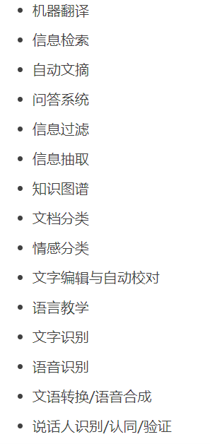

## 一、前言
>NLP是机器学习当中的掌上明珠，只有通过nlp才可能真正的达到“知情达意”的AI。这是一个从零开始学习NLP的项目，通过对项目的探索来达到了解、掌握基本nlp知识的目的。此项目来源于阿里云天池竞赛中的一个新闻文本分类的nlp赛题。
<!--more-->
## 二、什么是NLP
NLP全称是nature language process，也就是自然语言处理。在理解自然语言处理之前，我们需要先知道什么是自然语言。自然语言是人类在进化过程中的智慧的结晶，通过最原始的不同声音表达一定的含义，到提炼出音节，再构成词，最终连成句，这样的一个发展的过程看似简单，实则是经历了漫长的人类文明变迁史的淘洗，洗尽铅华，终于得到了“语言”这一瑰宝。现存的人类语言大概有1900多种，人类历史进程中学习到的知识超过80%通过文字语言记录下来。

*几个概念*
* 语音学：语音学（Phonetics）是一种非常基本的理论，一个正常的人类，有着相同的人体器官和相同的发声结构，就会遵循着相同的发声规则和原理。
* 语音体系：语音体系（Phonology）是有语义的声音的合集，不同的文明都有着各自的语音体系。
* 音素：音素（Phoneme）是语音中划分出来的最小语音单位，分为元音和辅音。
>整体来理解就是，人类的语言通过音素进行构建，搭建语音体系，形成语言交流系统，再通过符号化演变成文字，这样人类的语言就诞生了。人类的语言对于人类的发展来说意义重大，这是帮助人类文明不断演化的最大助力。到了信息时代，怎么让计算机来理解人类的语言文字就成了一个非常自然的课题，如果能够做到这一点，那么人类和计算机之间的交互融合将达到质的飞跃，人类文明很可能进入下一个时代。因此，现在这方面的研究都意义非凡，现在就让我们开始来进行学习吧。

## 三、nlp包括了什么
NLP是人工智能的一个子领域，在这个领域里，研究又分成了很多具体的方向，每个具体的研究方向又有着许多的研究课题及成果，下图就大概罗列了一下nlp包括的研究方向。

## 四、天池新闻文本分类比赛
### 1. 赛题
>赛题以自然语言处理为背景，要求选手根据新闻文本字符对新闻的类别进行分类，这是一个经典文本分类问题。通过这道赛题可以引导大家走入自然语言处理的世界，带大家接触NLP的**预处理**、**模型构建**和**模型训练**等知识点。
* 赛题名称：零基础入门NLP之新闻文本分类
* 赛题目标：通过这道赛题可以引导大家走入自然语言处理的世界，带大家接触NLP的预处理、模型构建和模型训练等知识点。
* 赛题任务：赛题以自然语言处理为背景，要求选手对新闻文本进行分类，这是一个典型的字符识别问题。

### 2. 赛题难点
>本题原本是一道普通的文本分类的题目，比较常见于日常生活，但是在此次比赛中，为了避免一些其他情况出现，数据被进行了匿名化处理，统一转换成了字符，即不可所见即所得，因此需要先对当前的数据进行一定的了解，之后再通过一些独特的建模方式来达到分类的目的。

### 3. 解题思路
如何进行文本的分类呢？分类的基础是不同的文本在使用的词汇、句式等特征上存在差异，而这些差异就是区分不同文本的依据，那我们做的第一步就是要选取有效特征，并且将这些特征量化表示，用来评价不同的文本，从而达到分类的目的。在这个比赛的过程中，有个难点就是文本数据进行了匿名化处理，也就是进行了转码，我们能够看到的数据并不是我们常规认识的数据，因此我们没有办法进行简单的分词、统计等等，这给我们提取特征造成了困扰。但是，其实对于计算机来说，不同的字符表达是等效的，只要采用的是统一的文本字符映射方法，那么在原文本中存在的特征，在新数据当中也存在，只不过表现形式可能不太相同，因此，我们可以通过相同的方式来进行**特征提取**，最终用这些特征来标记不同的文本，从而搭建**分类模型**进行分类。

官方提供了一些基本的解题思路，如下：
* 思路1：TF-IDF + 机器学习分类器
>直接使用TF-IDF对文本提取特征，并使用分类器进行分类。在分类器的选择上，可以使用SVM、LR、或者XGBoost。

* 思路2：FastText
>FastText是入门款的词向量，利用Facebook提供的FastText工具，可以快速构建出分类器。

* 思路3：WordVec + 深度学习分类器
>WordVec是进阶款的词向量，并通过构建深度学习分类完成分类。深度学习分类的网络结构可以选择TextCNN、TextRNN或者BiLSTM。

* 思路4：Bert词向量
> Bert是高配款的词向量，具有强大的建模学习能力。

4. 实践
上一部分中阐述的解题思路都可以进行尝试，在尝试的过程中要尝试去理解算法的含义，不能简单的调包了事，这样才能真正的有所学。实践将在后面的系列博客中逐一记录。

