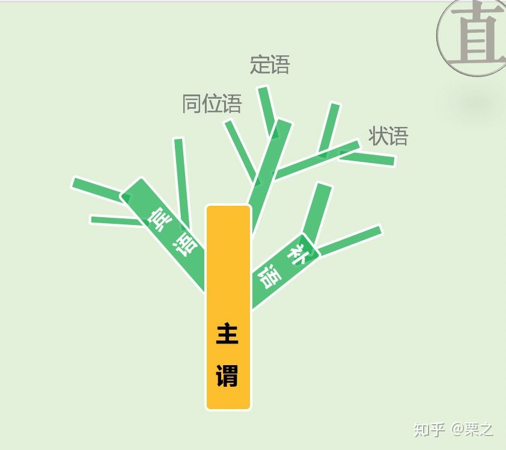
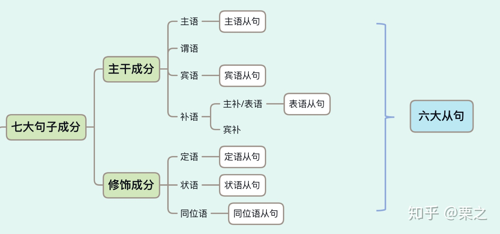

## 前言
最近在学习托福考试，预计不足两个月就要参加考试了。TOEFL全称是Test Of English as Foreign Language，考察内容分为听说读写四个板块，其中听和读是输入能力，说和写是输出能力，每个板块30分，总分120分，需要拿到一个比较好的成绩才有机会申请到好的学校，因此小目标是102，这需要我自己的努力。听力贯穿听、说、写三个部分，是非常关键的一项能力，这个能力可以在日常生活的间隙进行练习，刻意多练习；说的能力也需要日常生活中去练习；相对来说，读和写需要专门安排集中的时间段进行练习，这个需要自己适应环境。目前遇到的比较大的问题来自于阅读，问题在于阅读速度慢，暂时不看词汇量的限制，最重要的是对于句子的语法结构不熟悉，导致在阅读时比较难理解句子意思，因此脑海里总是困惑，阅读的速度和质量就降下来了，而速度和质量是非常重要的指标，必须将这两项指标提上去，才能取得好成绩。要想读懂句子，最直接的方式就是去认识、了解、学习句子，因此，学习英语的对应语法也就是必然了。在之前的博客里我记录过英语语法中的5大基本句式和16种时态的使用，这些是很基础的知识，还需要进一步学习。今天我将进一步学习和记录英语的语法知识——词法和句法。

<!--more-->

## 1. 语法概述
“句子”由一个个单词按照一定的规则组合得到，因此语法的组成部分也就呼之欲出了。语法由词法和句法两部分组成。词法总结的是单词的规律，单词根据词性可以分为9大词类和非谓语动词，而这些词类又可以分为实词和虚词；句法总结的是句子框架结构——7大句子组成成分、5大基础句式、6大从句样式、3种句子层次。其中句子中的7大组成成分中（主、谓、宾、定、状、补、同位语），主谓宾三种成分都已经比较了解，这次主要集中学习后面几种成分。另外，5大基础句式和3种句子层次（简单句、并列句、从句）也已经比较了解，可以另外安排时间复习。

## 2. 词法学习
任何的句子都是由单词连接而成，单词之余句子就是砖瓦之余房子，没有每一块砖瓦相接，也就所谓的房子，因此，首先我们要学习词法。

词语可以分为实词和虚词。实词指的是具有实际意义的词汇，比如名词、数词、形容词、副词、代词、动词，这些词汇都具有实际的含义；虚词指的是句子中的其他不能单独存在、没有明确实际含义的词汇，这些词汇一般是句子的修饰连接成分，比如冠词、介词、连词、助动词、感叹词等，分清楚实词和虚词，在我们造句的时候就可以正确使用了。

实词的含义非常好理解，这里不多加赘述，我们来看虚词。虚词中，感叹词也非常好理解，用于传递具体情绪，比如“ah啊"表示惊讶、惊吓等；介词表方位、方向，如on/in/up/down等；助动词用于补充动词，如am/are/is/can等，这些词和动词结合使用，共同构成句子成分，可以用于表示时态等特征；连词顾名思义就是连接句子的词，比如if/but/although等词，这些词可以在句子之间使用，标记句子之间的对应层级或因果关系等。

一个完整的句子一般都会由这些成分组成，换言之，我们在造句的时候也要注意充分利用这些句子成分，使我们构造的句子羽翼丰满，在表意准确的基础上，呈现出句子的美感，当然，我们目前追求的是第一步，也就是表意准确上。不同的句子成分可以从不同的角度帮助我们完成句子，因此，如果能充分利用这些成分，构造的句子自然也不会显得干瘦。

在我们之后的阅读训练中，要充分注意句子的组成成分，精读并且记忆，这样可以积累我们的使用技巧。

## 3. 句法学习
有了词汇的基础，我们就可以开始构造句子来传达自己的思想了。句子 = 主干 + 修饰成分，句子最重要的就是准确表达意思，因此句子需要主干明确，修饰适当。

主谓宾表显然是句子的主干，这些主干的组合方式也就是我们学习过的5大基础句式的组合方式：主谓、主谓宾、主系表、主谓宾宾补、主谓直宾间宾，这些内容很好掌握，这也是我们在阅读长难句、文章段落时特别要刻意关注的内容，因为这些主干就是句子的真正表意。修饰成分则是定语、状语、同位语这几种成分，我们来一一了解一下。

### 句法成分
定语Attribute，用于修饰主语。简单来说就是可以当「形容词」使用的成分，如sweet chestnuts 甜甜的栗子，「甜甜的」就是形容词作定语，修饰主语chestnuts。

状语Adverbial，用于修饰谓语，被称为副词性结构，如You laugh happily. 副词 happily 就是状语，修饰谓语动词laugh。

同位语Appositive，指的是一个名词(或其它形式)对另一个名词或代词进行解释或补充说明，那么两个名词之间也就是同位语关系了，如you, my sunshine, laugh happily. 这里my sunshine指的就是you，因此是you的同位语。

补语 Complement：补充说明主语或宾语。补语分为主语补足语和宾语补足语两大类，前者就是大家熟悉的「表语」，后者就是「宾补」。表语和宾语是句子的重要成分，如果缺少，那么句子的表意就会残缺，因此是句子的主干成分，这一点可能与中文有点不同，要留意观察。

### 6大从句
如图所示，除了以单词扮演句子的成分之外，还可以使用句子来充当对应的成分，而这些充当句子成分的句子也就是我们所说的从句。

这些从句既有充当主干成分的，如主语从句、宾语从句和表语从句，也有可以充当修饰成分的，如定语从句、状语从句和同位语从句，这些从句就是我们的6大从句。

在句法的三种层次结构中，简单句（如I like chestnuts.）和并列句（如I like chestnuts, but you like me.）并不会用到从句，只有复杂句会用到从句，换句话说，因为用了从句，这个句子变成了复杂句（如You tell me that you like me.）。通过观察我们可以发现，从句成分中也具有完整的主谓结构，也就是说，从句是表意完成的一个成分，也就是所谓的“从句是个句子法则”（出自知乎作者栗子），简称“从句句法则”。在我们构造从句的时候，千万要注意从句句子是否完整。

### 谓语唯一规律
在英语语法中存在一个规律：一般情况下，一个句子有且只有一个谓语。这一点非常重要，这对于我们检查我们的语句是否正确的时候帮助甚大。而且当我们阅读文章的时候，也可以通过这个规律更好的确定橘子的主干成分，从而解读句子。

## 4. 句子拆解
在阅读文章的时候，我们可以通过括号、下划线、箭头来辅助我们拆分句子，从而找到句子的主干和修饰成分，帮助我们解读句子。括号用于标示修饰成分，这些部分一般通过介词连接，所以我们可以关注在介词后的部分，这部分一般都是修饰成分；下划线用于标示主干成分，主干成分就是5大基础句式中的成分，这些成分在单词数上可能并不多，常常会淹没在句子的修饰成分中，这给我们的阅读理解带来了巨大的困扰，当然如果我们不熟悉的话。因此，通过我们一边阅读一边标记主干成分，同时标记修饰成分，将句子捋清楚，掌握句子的主干和修饰，最后通过箭头讲主干连接起来，在我们理解句子时就先看主干，再逐渐添加修饰成分即可。通过刻意的练习，我们一定能够提升我们的阅读能力，我们也能够从动笔划线慢慢转变成在脑海里划线，最终能够过目即懂。

## 总结
阅读是一项非常重要的能力，现阶段来看，必须要夯实好基础之后才能提升我们对应的阅读速度，因此不能心浮气躁，要一步一个脚印踏实学习。比如接下来的一周，在完成第一遍计时阅读训练后，要再进行一次精读训练，动笔标记文章句子架构，好好领会上述知识，提升自己的能力。