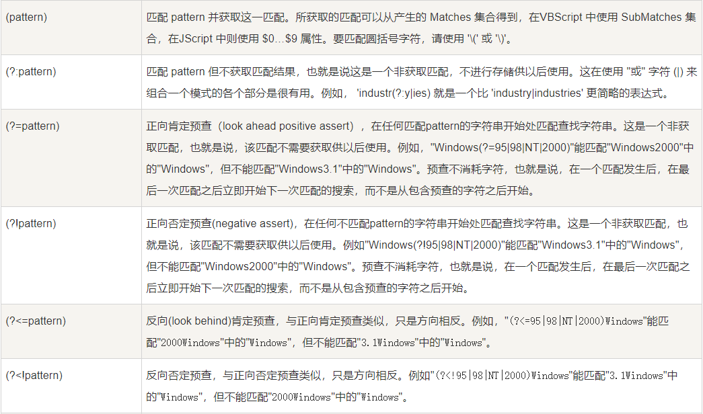
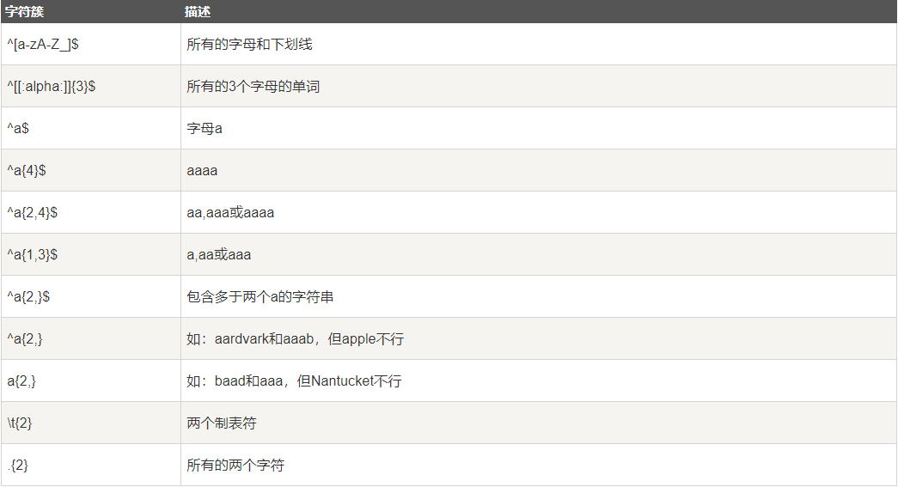
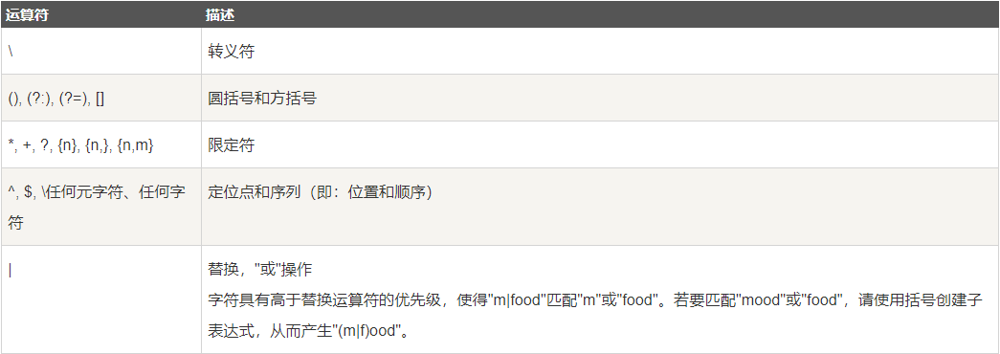

## 前言
正则表达式，也可以称之为“标准表达式”，是通用的字符匹配工具，在各种文本中，采用正则都可以匹配自己想要的内容，即使不同文本的编写格式各异。这也是正则的强大之处。正则由普通字符、非打印字符、特殊字符、限定符、定位符5部分构成，通过这5部分的排列组合，可以用于匹配各种特征的字符，在我们需要动态查找、匹配、替换时，意义重大。
<!--more-->

## 1. 普通字符
“普通字符”顾名思义，就是在文本中最主要的构成部分，包括没有显式指定为元字符的所有可打印和不可打印字符。这包括所有大写和小写字母、所有数字、所有标点符号和一些其他符号。这些字符可以直接写在正则中，匹配指定特征的文本。

## 2. 非打印字符
“非打印字符”指的是在文本的构建中会使用到用于格式化文本但是在打印显示中无法直接看到的字符，是文本编辑排版中必备的内容，但是就像是空气一样，作用与无形。下标列出了一些常见的非打印字符及含义。

|字符|描述|
|:----:|:----|
|\cx|x指的是A-Z a-z中的某个字符，和\c组合起来表达特定的含义。|
|\f|匹配一个换页符，等价于\x0c和\cL|
|\n|匹配一个换行符|
|\r|匹配一个回车符|
|\t|匹配一个制表符|
|\v|匹配一个垂直制表符|
|\s|匹配任何空白字符，包括空格、制表符、换页符、换行符等|
|\S|匹配任何非空字符|

## 3. 特殊字符
在正则表达式中保留的具有特定含义的字符，在进行通用匹配的时候非常重要。如果要匹配这些保留字符本身，需要使用'\'符号来进行转义。下表列出了正则中的特殊字符。

|特别字符|描述|
|:----:|:----|
|()|标记一个子表达式的开始和结束位置。提取后子表达式内容将单独保留到结果，其他字段不保留|
|*|匹配前一个表达式零次或者多次|
|+|匹配前一个表达式一次或者多次，不包括零次|
|?|匹配前一个表达式零次或者一次，也可表达匹配为非贪婪（贪婪往长了匹配，非贪婪寻找最短匹配目标）|
|.|匹配除\n之外的任何单字符，在通用匹配时很重要。|
|[]|中括号表达式，标记中括号表达式|
|{}|标记限定符表达式的开始。|
|\|转义字符，标志其他特殊字符转化为普通字符|
|$|匹配输入字符串的结尾位置|
|^|匹配输入字符串的开始位置，在[]内时表示取反含义。|
|\||选择字符，在两项之中匹配一项|

## 4. 限定符
限定符用来指定特定表达式出现的次数设定，比如某个相同特征在同一个段区间内要重复几次或者未知若干次，那此时就可以使用限定符来限定次数。

|字符|描述|
|:----:|:----|
|*|匹配前一个表达式零次或者多次|
|+|匹配前一个表达式一次或者多次，不包括零次|
|?|匹配前一个表达式零次或者一次，也可表达匹配为非贪婪（贪婪往长了匹配，非贪婪寻找最短匹配目标）|
|{n}|n为非负整数，表示匹配n次|
|{n,}|表示至少匹配n次，无上限|
|{n, m}|至少匹配n次，至多匹配m次|

## 5. 定位符
定位符可以将正则表达式固定到行首或者行尾。定位符用来描述字符串或单词的边界，^ 和 $ 分别指字符串的开始与结束，\b 描述单词的前或后边界，\B 表示非单词边界。
>注意：不能将限定符与定位符一起使用。由于在紧靠换行或者单词边界的前面或后面不能有一个以上位置，因此不允许诸如 ^* 之类的表达式。 若要匹配一行文本开始处的文本，请在正则表达式的开始使用 ^ 字符。不要将 ^ 的这种用法与中括号表达式内的用法混淆。 若要匹配一行文本的结束处的文本，请在正则表达式的结束处使用 $ 字符。

## 6. 补充拓展
1. pattern使用

2. 精确匹配

## 7. 优先级

## 总结
在学习完一遍之后，发现其实正则也并不难，在我们观察文本找到我们需要匹配的文本时，只要选择好明确的特征，然后把这个特征用正则描述出来就能匹配到我们需要的内容，有些时候目标文本本身特点不好描述时，如果该目标文本内容的前后有一些特殊的字符串，那也可以使用这些特殊的字符串当特征来进行匹配，只需要使用“()”来将中间的目标字符串的表达式包括起来，那么在返回的结果中就会只返回这个子表达式的匹配内容，而其他的正则表达式就充当了定位符的作用。总而言之，熟能生巧，今天学习一遍之后并不觉得难，但是如果不常使用，终归是会淡忘的，所以要多注意，多尝试使用，温故而知新。