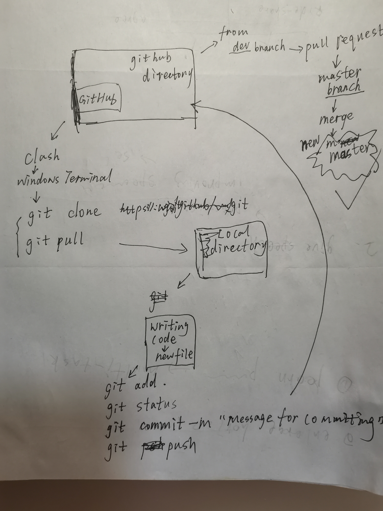

### 前言
前段时间刚好博客失效，一直没有办法同步到GitHub上，觉得很奇怪，明明可以访问GitHub，为什么会出现deploy时的timeout呢？而且因为项目需求，同时也需要使用git进行项目代码管理，也是timeout，最后发现，应该是系统的代理并没有在终端的控制中起作用，因此从终端命令行无法访问GitHub，所以timeout，无法上传代码。发现问题之后，一个解决方法就是clash本身可以打开使用了代理的terminal，因此，可以在这个terminal上访问GitHub，问题也就迎刃而解了。下面说说解决方案，以及学会的GitHub的一个pull request操作。

<!--more-->

### 解决流程
首先看图：

由图可以看出，我们使用git进行整个版本控制的过程：
1. 第一步：通过git clone项目代码的https链接，在本地建立代码仓库，然后直接进入新仓库；或者之前下载好了代码，第二次操作，则直接进入仓库代码。
2. `git branch`查看当前所在分支，是否在开发分支，如果不在，则切换分支。当然，一般进来后，会在路径处显示在哪个分支；
3. `git remote -v`查看当前分支对应的远程分支是什么，如果不是推送分支的话，可先修改。
   1. `git branch --set-upstream-to=origin/dev dev`，将本地的dev分支链接到远程的origin/dev的分支上
4. `git pull` 拉取项目最新代码结果；
5. 在项目工作路径中编辑代码，进行工作；
6. `git add .`工作完毕，通过此命令将文件添加到git管理中；
7. `git commit -m "Messeage for commiting"`通过此命令进行代码提交前的comment标注，在GitHub上可以看到这个提交备注，方便管理者判断新提交代码的功能和内容；
8. `git push `通过此命令，将本地代码推送到GitHub服务器上对应的项目分支；
9. 推送完毕后，进入GitHub网站，查看文件推送是否成功；
10. 成功推送后，找到对应的分支，点击pull request，提交一个新的pull request，选择对应pull request的分支，将新内容分支合并到稳定分支中，随后比较文件，确认无误后，合并分支代码内容，也就是更新了稳定分支，最终代码更新完毕；
11. 开始新的一轮工作循环。