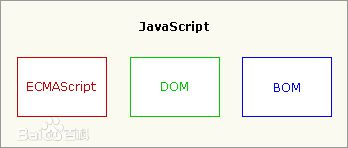

## **第一部分：JS介绍及基础知识**
>### 目录
1. 初识JavaScript
2. 变量和常量的知识
3. 基本数据类型
4. 运算符
5. 基本数据类型间的转换
6. 流程控制语句

### 1. **初识JavaScript**
**概述**：
>**JavaScript**一种直译式脚本语言，是一种动态类型、弱类型、基于原型的语言，内置支持类型。它的解释器被称为**JavaScript引擎**，为浏览器的一部分，广泛用于客户端的脚本语言，最早是在HTML（标准通用标记语言下的一个应用）网页上使用，用来给HTML网页增加动态功能。<br>

**javascript组成** 
>（1）**ECMAScript**，描述了该语言的语法和基本对象。<br>
（2）文档对象模型（**DOM**），描述处理网页内容的方法和接口。<br>
（3）浏览器对象模型（**BOM**），描述与浏览器进行交互的方法和接口<br>

<!--more-->
**应用**<br>
>（1）嵌入动态文本于HTML页面。<br>
（2）对浏览器事件做出响应。<br>
（3）读写HTML元素。<br>
（4）在数据被提交到服务器之前验证数据。<br>
（5）检测访客的浏览器信息。 <br>
（6）控制cookies，包括创建和修改等。<br>
（7）基于Node.js技术进行服务器端编程。<br>

### 2. **变量与常量认识**
**引入**
>javascript的引入有三种方式:<br>
（1）写在标签内<br>（2）使用\<script>\</script>标签<br>（3）独立js文件，使用link引入
```
标签内
<style type="text/css">
    #div {background-color:red;}   //#是id标签
    .p {color:blue;}               //'.'是class类标签
</style>

script标签
<scipt tpye="text/javascript">js语句</script>

引入
<script src="" type="text/javascript"></script>
<link href="https://..." rel="stylesheet">
```

**标识符与关键字**
>
****
## **第二部分：jsDOM操作**
>### 目录
1. 属性、文本操作
2. css操作
3. 对象与数组
4. 面向对象编程