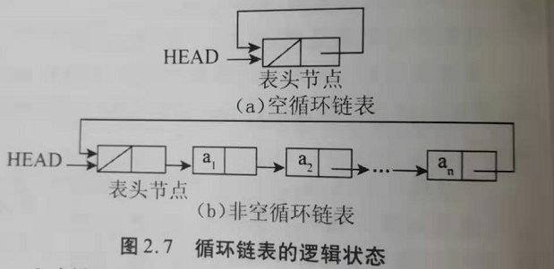
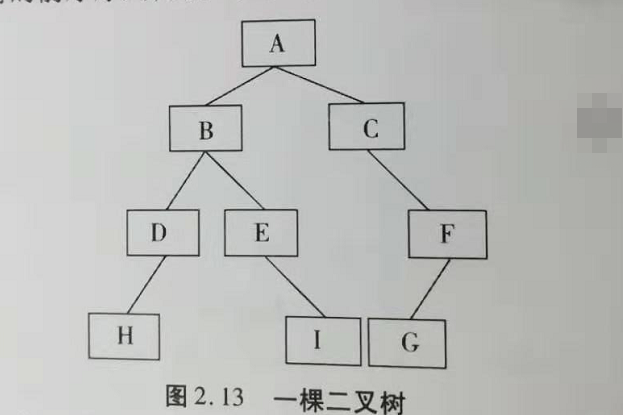

## 写在前面
>这是篇为了记录计算机基础知识学习笔记的博客，希望自己能够充分利用博客这个工具，提高自己的学习效率和改善学习效果。另外，这也是在接下来的计算机二级考试的备考内容之一。这会是一篇持续更新的博客，希望能够写得完善一些。

## 1. 什么是算法？
>**算法是指对解决方案的准确而完整的描述，简单来说，就是解决问题的步骤。**

 
|基本特征|具体描述|
|----|----|
|可行性|步骤可以实现，执行能够达到预期目的|
|确定性|步骤明确，每一步意义清晰|
|有穷性|有限步骤，有限时间内能完成|

<!--more-->
### 算法的复杂度
1. 时间复杂度：执行算法所需要的计算工作量
2. 空间复杂度：执行算法需要的内存空间

## 2. 数据结构的基本概念
### （1）什么是数据结构？
>**数据结构值得是相互有关联的数据元素的集合。**
* 逻辑结构
* 存储结构
### （2）数据结构的表示
```
B = (D, R)
B表示数据结构
D是数据元素的集合
R是数据各元素之间的关系
```
|基本概念|含义|
|----|----|
|根节点|数据结构中没有前件的节点|
|叶子节点|没有后件的节点|
|内部节点|除了根节点和叶子节点外的节点|
### （3）线性结构与非线性结构
|基本概念|含义|
|----|----|
|线性结构|非空，每一个节点最多有一个前件和一个后件|
|非线性结构|非空，每一个节点可以有多于一个前件或后件的数据结构|


## 3. 线性表及其顺序储存结构
### （1）线性表
>线性表即**线性数据结构**，表示如下
```
(a1, a2, a3, ...,ai,...,an)
```
**通常**，线性表可以采用*顺序存储*和*链接存储*两种存储结构
|基本概念|含义|
|----|----|
|顺序存储|存储地址是连续的、相邻的|
|链接存储|存储地址可以不连续，不过在逻辑上是连续的，<br>由头指针和尾指针进行定位|

>采用顺序存储是表示线性表最为简单的方法，这种顺序表示的线性表也称**顺序表**

## 4. 栈（Stack）与队列（Queue）
### (1)栈及其基本运算
>栈是一种特殊的**线性表**，先进后出、后进先出原则，操作有三：入栈、退栈、读栈
### （2）队列及其基本运算
>队列也是一种特殊的**线性表**，先进先出、后进后出，运算多为指针头移动
>>循环队列：即最后一个元素的指针将指回第一个元素前一个空元素的位置，导致前后相连。

## 5. 线性链表
### （1）线性链表的基本概念
>**线性链表**是指在线性表的链式存储结构，简称链表。占用空间除了数据域，还有指针域，故而会比较多空间。一般链表为单向链表，但是如果在每一项之中添加一个指向前一个元素的指针，那就可以变成**双向链表**。

|类型|优点|缺点|
|-----|----|----|
|顺序表|（1）可以随机存取表中任意节点<br>（2）地址顺序即逻辑顺序，无需额外空间|（1）插入和删除的运算效率低下<br>（2）储存空间不便于扩展<br>（3）不便于储存空间动态分配|
|链表|（1）插入、删除只需移动指针，无需移动储存位置<br>（2）空间易扩展，方便动态分配空间|需要额外的空间储存逻辑关系，存储密度比顺序表低|


（2）循环链表
>在单链表的第一个节点前增加一个表头节点，队头指针指向表头节点，最后一个节点的指针域的值由NULL改为指向表头节点，这样就形成了一个循环链表。
>>在循环链表中，只要知道了一个节点的位置，就可以从它出发访问到所有的节点，并且在链表为空时，链表中仍然还有表头节点这个节点，因此能够当成非空链表运算，因此统一了空链表与非空链表的运算。



## 6. 树与二叉树
### （1）树的基本概念
>树（Tree）是一种简单的非线性结构。例如家族族谱关系等。

|基本概念|含义|例子|
|----|----|----|
|父节点|在树结构中，每一个节点只有一个前件，<br>即它的父节点，所有节点最终的父节点<br>为根节点。|如从一棵树的所有枝丫都发源于树干，树干有个根。|
|子节点|每个节点可以有多个后件，这些后件即为子节点，没有后件的节点称为叶子节点|正如树的叶子是树的结构的末端，其后没有其他节点了|
|度|一个节点拥有的后件的个数称为该节点的度，所有节点中最大的度即为该树的度（注意，**后件的后件不是该节点的后件**）。|例如树的各个枝丫上有数量不同的枝丫或者树叶，这个数量就是目前枝丫的度|
|深度|定义根所在的层次为1，其他节点所在层次等于它的父节点所在层次+1，树最大的层次即为树的深度|如果从根算起，最多共经过4次转折到达了叶子的节点，那么这棵树的深度即为4+1=5|
|子树|在树中，以某一个节点为根构建的新的树，称为该树的子树|相当于树上的大树枝，如果把大树枝看成是起点的话，那这个构建的新的树就是原来树的子树|

### （2）二叉树
>二叉树与树不同，但是与树的结构很相似。（我个人觉得，二叉树就是一种特殊的树结构）

**特点如下**
* 可以为空，空的二叉树没有节点，非空的二叉树有且只有一个根节点。
* 每个节点最多有两棵子树，即不存在度大于2的节点。
* 子树有左右之分，次序不能颠倒。

**性质如下**
1. 在二叉树的第k层上最多有2^(k-1)个几点，k大于等于1。
2. 深度为m的二叉树，最多有2^m-1个节点（比如深度为4的树最多有2^4-1=16-1=15个节点）。
3. 任何一棵树，其中度为0的叶子节点总是比度为2的节点的数量多1个（可以自己分类讨论进行验证）。
4. 具有n个节点的二叉树，其深度至少为n对2取对数运算的整数部分（记为d），则深度至少为d+1,即相当于是2^d-1=n。
5. 具有n个节点的完全二叉树的深度为d+1（d含义同上）。
>`满二叉树`是指除了最后一层外，其他层的节点都是度为2的节点。<br>`完全二叉树`是指除了最后一层外，每一层的节点数均达到最大值，在最后一层上只缺少右边的若干节点的二叉树。

### （3）二叉树的存储结构
>在计算机中，二叉树通常采用链式存储结构。其存储的节点由数据域与指针域两部分组成，由于每一个节点可以有两个后件，所以每个节点需要有2个指针，分别为左指针域和右指针域。*二叉树的链式存储结构也叫二叉链表*。

|遍历方法|含义|
|----|----|
|前序遍历|首先访问根节点，然后按照先左后右的原则一直访问到叶子节点，例子如下图前序遍历，遍历顺序为A B D H E I C F G。|
|中序遍历|首先遍历左子树，然后访问根节点，最后遍历右子树。例子如下图，遍历顺序为H D B E I A C G F。|
|后序遍历|先左子树，后右子树，最后根节点。如下图，遍历顺序为H D I E B G F C A。|



## 7. 查找技术
|概念|含义|分析|
|----|----|----|
|顺序查找|从线性表的第一个元素开始，逐个比较最终找出目标元素，查找停止|（1）最好的时候，第一个即为查找元素，比较次数为1。<br>（2）最坏情况，最后一个才是目标元素，比较次数为n。<br>综上，平均为(n+1)/2|
|二分法查找|在有序的线性表中，将查找元素与中间元素进行比较，以指数级速度缩小查找范围，最终锁定目标元素。|最好情况为比较1次，最差情况为比较log..n次（‘..’表示数字‘2’）。|

## 8. 排序技术
|概念|含义|分析|
|:----|----|----|
|冒泡排序法|通过两两相邻的数据之间比较，不断调整大小顺序，不断的重复，直到所有的数据都有序为止|最坏情况，比较次数为(n-1)n/2|
|快速排序法|在待排序元素中选取一个数K（一般为第一个数），以K为标准，大于K的排在K后面，小于K的排在K前面，得到两个子表，对这两个子表进行同样的操作，直到所有的数均有序后停止。|最坏情况，比较次数为(n-1)n/2|
|简单插入排序法|把待排序的n个元素看成是有序表和无序表，最开始有序表只有1个元素，无序表有n-1个元素，接下来在无序表中选取元素插入有序表中的正确位置，重复操作直到所有元素都插入到了正确的位置即停止。|最多比较(n-1)n/2次|
|希尔排序|将n个元素分为a1个组（a < n），在每一组之间进行简单排序，再将序列分为a2个组（a2 < a1），重复操作，直到最后an=1，即只有一个分组时排序完成。|最多次数为n^r，其中（1< r < 2）。|
|简单选择排序法|先选出最小元素与第一个元素交换位置，剩下元素再找最小元素与第二个元素交换位置，直到所有排序完毕。|最多比较(n-1)n/2次|
|堆排序法|`堆`是一个比较特别的完全二叉树的结构，在这种特殊情况下进行特殊排序，称为**堆**排序法。|最多nlog..n次，其中‘..’表示数字‘2’。|
>**堆**是用数组表示的二叉树，在堆里面，只有数组元素的排列顺序，没有额外的逻辑数据，在某些条件下，堆的优势很明显。

## 结语
>写到这，关于数据结构与算法的基础入门知识就是这些了，还有一些其他内容还要进一步学习。
